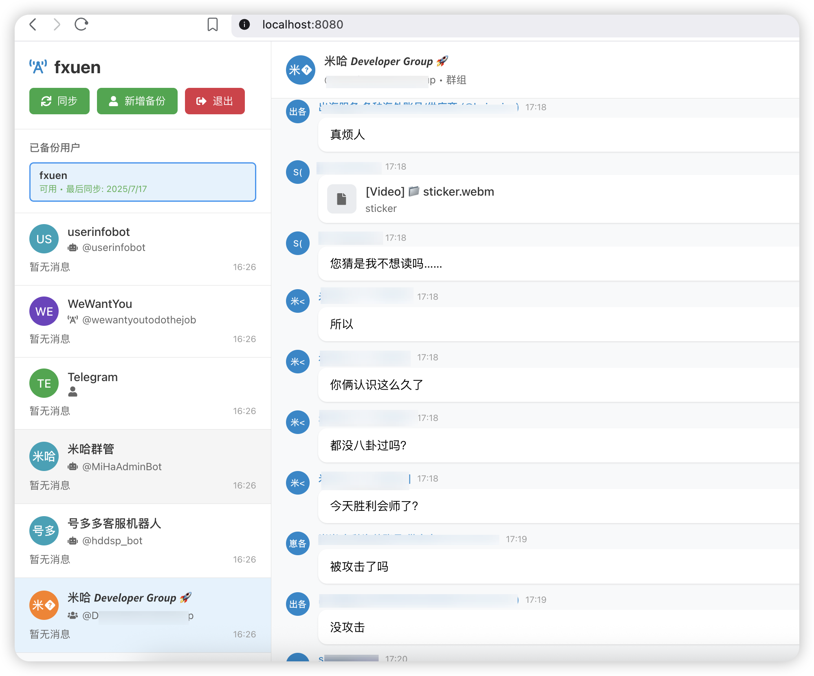

# TgBackup - 智能 Telegram 备份工具

可能还有一些bug

> 🚀 一个现代化的多用户 Telegram 消息备份解决方案，专为防止账号封锁而设计



## ✨ 核心特性

### 🔐 多种登录方式
- **QR码登录**: 使用 Telegram 手机端扫码快速登录
- **手机验证**: 输入手机号码接收验证码登录
- **Session持久化**: 避免重复登录，一次认证长期有效

### 🏠 离线优先设计  
- **无需登录查看**: 备份数据可在session失效后继续访问
- **本地存储**: 所有数据存储在本地 SQLite 数据库
- **防封号备份**: 专为防止 Telegram 账号封锁设计

### 👥 多用户支持
- **多账号管理**: 支持备份多个 Telegram 账号
- **独立数据隔离**: 每个用户的数据完全独立存储
- **用户状态监控**: 实时显示账号的活跃状态

### 🔄 智能同步机制
- **启动自动同步**: 应用启动时自动恢复session并同步数据
- **定时后台同步**: 每分钟自动检查并同步最新消息
- **增量更新**: 仅同步新增和变更的消息，提高效率

### 💬 全面消息支持
- **全类型会话**: 用户、机器人、群组、频道、超级群组
- **多媒体消息**: 图片、视频、音频、文档、贴纸
- **消息元数据**: 发送者信息、时间戳、消息类型
- **用户信息解析**: 显示真实姓名和用户名

### 🎨 现代化界面
- **响应式设计**: 适配各种屏幕尺寸
- **直观操作**: 清晰的用户列表、会话列表、消息展示
- **实时刷新**: 前端定时刷新确保数据最新
- **状态显示**: 实时显示用户状态和同步状态

## 🛠️ 技术架构

### 后端技术栈
- **Go 1.21+**: 高性能后端服务
- **Gin Framework**: 轻量级Web框架
- **SQLite**: 本地数据库存储
- **gotd/td**: 官方 Telegram MTProto 客户端
- **CORS支持**: 跨域请求处理

### 前端技术栈
- **React 18**: 现代化前端框架
- **Styled Components**: CSS-in-JS 样式解决方案
- **React Router**: 单页应用路由
- **Axios**: HTTP 客户端
- **React Icons**: 图标库

### 数据库设计
```sql
users table          # 用户信息表
├── id (Telegram用户ID)
├── first_name        # 真实姓名
├── username          # 用户名
├── phone            # 手机号
├── is_active        # 是否活跃
└── last_sync_time   # 最后同步时间

conversations table   # 会话表
├── id               # 会话ID
├── user_id          # 关联用户ID
├── type             # 会话类型(user/bot/group/channel)
├── title            # 会话标题
├── username         # 会话用户名
└── access_hash      # 访问哈希

messages table        # 消息表
├── id               # 消息ID
├── user_id          # 关联用户ID  
├── conversation_id  # 关联会话ID
├── from_id          # 发送者ID
├── content          # 消息内容
├── message_type     # 消息类型
└── timestamp        # 时间戳
```

## 🚀 快速开始

### 环境要求
- **Go**: 1.21 或更高版本
- **Node.js**: 16 或更高版本
- **Git**: 用于克隆项目

### 1. 获取 Telegram API 凭证
1. 访问 [Telegram API](https://my.telegram.org/auth)
2. 登录您的 Telegram 账号
3. 点击 "API development tools"
4. 创建新应用获取 `app_id` 和 `app_hash`

> 💡 **提示**: 应用已内置默认API凭证，可直接使用

### 2. 安装和运行

```bash
# 1. 克隆项目
git clone <repository-url>
cd tgBackup

# 2. 安装Go依赖
go mod download

# 3. 安装前端依赖并构建
cd web
npm install
npm run build

# 4. 启动应用
cd ..
go build -o tgbackup
./tgbackup
```

### 3. 访问应用
打开浏览器访问: **http://localhost:8080**

## 📱 使用指南

### 首次使用
1. **查看已备份用户**: 主页显示所有已备份的用户列表
2. **添加新备份**: 点击"新增备份"按钮添加新的 Telegram 账号
3. **选择登录方式**: QR码扫描或手机号验证
4. **自动同步**: 登录成功后自动开始后台同步

### 日常使用
1. **查看备份**: 无需登录即可查看所有已备份的数据
2. **切换用户**: 点击用户列表切换查看不同账号的数据
3. **浏览消息**: 选择会话查看完整的聊天历史记录
4. **自动更新**: 系统每分钟自动同步最新消息

### 高级功能
- **退出确认**: 输入"确认删除"才能退出，防止误操作
- **状态监控**: 实时显示用户活跃状态和最后同步时间
- **增量同步**: 智能检测并仅同步新增消息

## 🔧 开发指南

### 后端开发
```bash
# 开发模式运行
go run main.go

# 构建生产版本
go build -o tgbackup

# 运行测试
go test ./...
```

### 前端开发
```bash
cd web

# 开发模式 (热重载)
npm start

# 构建生产版本
npm run build

# 代码检查
npm run lint
```

### API接口文档

#### 用户管理
- `GET /api/v1/users` - 获取所有用户列表
- `GET /api/v1/users/:id/conversations` - 获取指定用户的会话

#### 认证相关
- `POST /api/v1/auth/login` - 登录(支持QR和手机)
- `POST /api/v1/auth/verify` - 验证码确认
- `GET /api/v1/auth/status` - 获取认证状态

#### 数据同步
- `GET /api/v1/conversations` - 获取会话列表
- `GET /api/v1/conversations/:id/messages` - 获取消息
- `POST /api/v1/sync` - 手动触发同步

#### 实时通信
- `GET /api/v1/ws` - WebSocket连接

## 🔄 同步机制

### 自动同步策略
- **启动同步**: 应用启动后3秒自动同步
- **定时同步**: 每60秒自动检查活跃用户并同步
- **前端刷新**: 每30秒刷新界面数据

### 同步内容
- 会话列表更新
- 新消息获取 (每次最多50条)
- 用户状态检查
- Session有效性验证

### 错误处理
- Session失效自动标记用户为非活跃
- 网络错误自动重试
- 详细的日志记录

## 📂 项目结构

```
tgBackup/
├── main.go                    # 应用入口，包含自动同步逻辑
├── go.mod/go.sum             # Go模块依赖
├── internal/                 # 内部包
│   ├── api/
│   │   └── handlers.go       # API处理器，多用户支持
│   ├── database/
│   │   └── database.go       # 数据库操作，多用户模型
│   ├── models/
│   │   └── models.go         # 数据模型定义
│   └── telegram/
│       └── client.go         # Telegram客户端封装
├── web/                      # React前端
│   ├── src/
│   │   ├── components/       # 可复用组件
│   │   ├── pages/           # 页面组件
│   │   ├── hooks/           # 自定义Hook
│   │   └── utils/           # 工具函数
│   └── build/               # 构建输出
├── sessions/                 # Session存储目录
├── tgbackup.db              # SQLite数据库
└── README.md                # 项目文档
```

## ⚠️ 重要说明

### 安全性
- ✅ 所有数据存储在本地，无隐私泄露风险
- ✅ Session数据加密存储
- ✅ 支持多用户独立权限控制

### 性能优化
- ✅ 增量同步减少API调用
- ✅ 前端请求去重和缓存
- ✅ 数据库索引优化查询性能

### 使用限制
- ⚠️ 需要合法的 Telegram API 凭证
- ⚠️ 受 Telegram API 限制影响
- ⚠️ 大量历史消息同步需要时间

### 数据迁移
当前版本支持从单用户架构自动迁移到多用户架构，保留所有历史数据。

## 🤝 贡献指南

欢迎提交 Issue 和 Pull Request！

1. Fork 项目
2. 创建特性分支 (`git checkout -b feature/AmazingFeature`)
3. 提交更改 (`git commit -m 'Add some AmazingFeature'`)
4. 推送到分支 (`git push origin feature/AmazingFeature`)
5. 开启 Pull Request

## 📄 许可证

本项目基于 MIT 许可证开源 - 查看 [LICENSE](LICENSE) 文件了解详情

## 🆘 支持

如遇问题请：
1. 查看 [Issues](../../issues) 是否有相似问题
2. 创建新的 Issue 详细描述问题
3. 提供日志信息和复现步骤

---

**🎯 专为防封号而生，让您的 Telegram 数据永不丢失！**